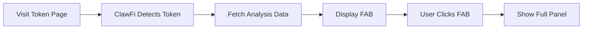

# Extension Overview

The ClawFi browser extension provides real-time crypto intelligence directly on the websites you use for trading.

## Key Features

### 1. Floating Action Button (FAB)

When you visit a token page on a supported site, ClawFi displays a floating button that shows:
- Current risk level (green/yellow/red)
- Number of active signals
- Quick access to full analysis

### 2. Analysis Panel

Click the FAB to expand the full analysis panel:
- Risk score and breakdown
- Active signals and alerts
- Market data summary
- Quick actions

### 3. Automatic Detection

ClawFi automatically:
- Detects when you're viewing a token
- Extracts the token address from the URL
- Fetches real-time analysis data
- Updates as you navigate between tokens

## User Interface

### Popup

Click the ClawFi icon in your toolbar to access:
- Quick settings toggle
- Extension status
- Recent activity
- Help & support links

### Options Page

Access detailed settings by right-clicking the icon and selecting "Options":
- Full configuration options
- API key management
- Alert preferences
- Data export

### Overlay Components

#### Risk Badge
```
🟢 Low Risk    - Score 0-30
🟡 Medium Risk - Score 31-70
🔴 High Risk   - Score 71-100
```

#### Signal Badge
Shows count of active signals with severity indicators.

#### Analysis Panel Sections
1. **Risk Overview** - Overall risk score and factors
2. **Signals** - Active alerts and warnings
3. **Market Data** - Price, liquidity, volume
4. **Contract Info** - Verification status, owner details

## How It Works



### Data Flow

1. **Content Script Injection** - ClawFi injects analysis UI into supported pages
2. **Token Detection** - Parses URL/page to identify token address and chain
3. **API Request** - Fetches analysis from ClawFi API (with caching)
4. **UI Rendering** - Displays results in the overlay panel
5. **Real-time Updates** - Refreshes data periodically or on navigation

## Privacy & Security

### Data We Collect
- Token addresses you analyze (for caching)
- Anonymous usage analytics (optional)

### Data We Don't Collect
- Wallet addresses or balances
- Transaction history
- Personal information
- Browsing history outside supported sites

### Permissions Explained

| Permission | Reason |
|------------|--------|
| `activeTab` | Read current page URL to detect tokens |
| `storage` | Save your settings locally |
| Host permissions | Inject overlay on supported sites |

## Performance

ClawFi is designed to be lightweight:
- **Memory**: ~5-10MB typical usage
- **CPU**: Minimal impact, only active on token pages
- **Network**: Cached responses, rate-limited requests
- **Battery**: No background activity when idle

## Next Steps

- [Supported Sites](supported-sites.md) - See all compatible platforms
- [Risk Indicators](risk-indicators.md) - Understand risk scoring
- [Signal Types](signals.md) - Learn about different signals
- [Settings](settings.md) - Configure the extension
